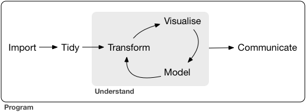

In this exercise we will cover some aspects relevant to communicating and most importantly **re**producing analysis.

We will use the libraries and data we covered in the previous episode [Application for microbiome data](https://siobhonlegan.com/2025-11-13-COMBINE-WA/10-application-microbiome.html).

## Why the emphasis on reproducible analysis

[](https://r4ds.had.co.nz/introduction.html)

Research is rarely a straight line. Imagine this common scenario:

- A research student runs a preliminary analysis and shares results with their supervisor for feedback.
- The supervisor suggests changes—perhaps a different filtering threshold, an alternative normalization method, or adding new samples.
- The student now needs to reanalyse the data, often weeks later. Without a clear record of the original steps, this can mean starting from scratch, risking inconsistencies and wasted time.

The same challenge applies to research staff working in teams. When multiple people collaborate on a project, unclear workflows can lead to:

- Confusion about which version of the analysis is current.
- Difficulty reproducing figures or tables for publications.
- Problems when revisiting the project months or years later.

**Reproducibility = Transparency + Efficiency**

Reproducible analysis ensures that:

- Every step of your workflow is documented.
- Analyses can be rerun easily after updates or corrections.
- Collaborators (and future you!) can understand and verify your work.

**Our Approach in This Workshop**

For this exercise, we will use R Markdown and Quarto notebooks—powerful tools for reproducible research. These allow you to:

- Combine code, results, and narrative in one document.
- Automatically regenerate outputs when data or code changes.
- Share complete, executable workflows with colleagues or supervisors.

## Load packages

Now load in the required packages for this analysis

```{r, message=FALSE, warning=FALSE}
library(microbiome)
library(knitr)
# load the peerj32 dataset
data(peerj32)
```

## Reproducible data

Let's say you have spent a long time getting your data formatted and read into R.

Now you will want to do some visualizations on this data and it is likely this will need to be repeated (many) times in the future.

You can save your data in and `.rda` or `.rds` format so that it will allow you to quickly read it back into the work space and pick up on more figures. It will also made it easy to read in and generate reports in a reproducible way (which we will do shortly).

Have a go at saving the `peerj32` object that is in your environment to your local directory. If you have followed the previous episodes in this lesson you should already have a **data/** directory.

```{r}
save(peerj32, file = "data/peerj32.rda")
```

You can quickly load the `.rda` file back in

```{r}
load("data/peerj32.rda")
```


## Making reproducible and easy to share reports

Next you will download a have prepared a `.qmd` file and then work through the code chunks and "knit" the document to a reproducible a `.html` file for communication.

::: callout

### The Situation - Sharing Results

Imagine you need to give your supervisors a summary of your findings early on, instead of spending weeks neatly formatting and exporting plots one by one in R you may like to share this html file early in your analysis to get some general feedback and direction before find tuning your analysis.

:::

It is best practice to not re-install the packages each time when making these reports, so ensure you have the required packages installed prior to running.

```{r eval=FALSE}
# Install your CRAN packages for the qmd
install.packages("gtsummary")
install.packages("reshape2")
install.packages("knitr")
install.packages("dplyr")
install.packages("DT")

## install your Bioconductor packages
if (!require("BiocManager", quietly = TRUE))
    install.packages("BiocManager")

BiocManager::install("microbiome")
BiocManager::install("phyloseq")
```

Download the `.qmd` file

```{r eval=FALSE, include=TRUE}
download.file(
  url = "https://raw.githubusercontent.com/siobhon-egan/2025-11-13-COMBINE-WA/refs/heads/main/episodes/files/microbiome-data-report.qmd",
  destfile = "data/microbiome-report.qmd"
)
```

Have a go at rendering the `.qmd` file.

::: challenge

### Challenge

Practical opening and "knitting" the `.qmd` file to html output.
:::

```{r, echo=FALSE, results='asis'}
htmltools::includeHTML("files/microbiome-data-report.html")
```

## Session info

When sharing R Markdown (.Rmd) or Quarto (.qmd) notebooks, it's good practice to include information about your R session at the end of the document. This helps others (and future you!) understand:

-   Which version of R was used
-   What packages were loaded
-   What platform the code was run on

```{r}
sessionInfo()
```

Some other similar handy functions include:

-   `devtools::session_info()` - more detailed, especially for package dependencies, and identifies where packages were installed from.
-   `renv::snapshot()` – for managing project-specific environments.

## Recommendations

Some recommendations for rendering your `.qmd`:

-   Hide warnings and messages from your R chunks
-   Keeping your code in the output can be good to see what data was used for analysis and if any filtering or transformations were used, however it is not always neccessary and can make it difficult for other "non-coders" to read. In the "YAML" at the top you will see the option `code-fold: true` is used to allow us to toggle the code on and off.
-   Include the `sessionInfo()` at the bottom of your file to keep track of package versions used!

------------------------------------------------------------------------

::: keypoints

-   Saving your data in `.rda` format can make it easier to load and repeat data analysis.
-   A notebook in `.rmd` or `.qmd` format and knitted to html can be an efficient way to store and share data workflows and analysis
-   Use `sessionInfo()` when using R to generate reports as a handy way to track package versions used to generate analysis and figures.

:::
